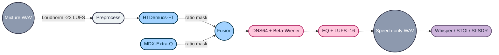
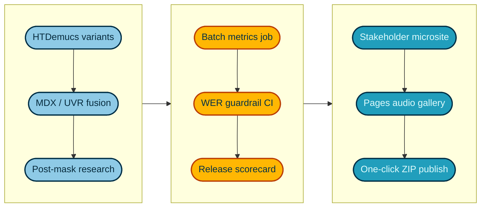

### 🎧 Speech-Only Rendering Pipeline

<p align="center">
  
</p>

This repo contains an end-to-end pipeline for removing backing music from TTS outputs using HTDemucs-FT, MDX-Extra-Q, DNS64 denoiser, beta-Wiener post-masking, and LUFS normalization.

<p align="center">
  
  
  
  
  
</p>

| Layer | Stack | Highlights |
|-------|-------|------------|
| Separation | Python 3.10 · PyTorch 2.5 · Torchaudio · Demucs/MDX | GPU-accelerated hybrid masking with HTDemucs-FT + MDX-Extra-Q |
| Enhancement | DNS64 · Beta-Wiener · ffmpeg | Speech denoising + LUFS shaping |
| Tooling | Bash · Git LFS · Mermaid docs | Batch scripts, Colab notebooks, narrative docs |

#### Contents
- [Layout](#-layout)
- [Colab heavy run](#colab-heavy-run)
- [Core Idea](#-core-idea)
- [Usage Cheatsheet](#-usage-cheatsheet)
- [Quick Listen](#-quick-listen)
- [Pipeline Highlights & Metrics](#-pipeline)
- [Improvement roadmap](#-todo-roadmap)

### Colab Heavy Run

| Parameter | Value | Why |
|-----------|-------|-----|
| `--shifts` | 100 | Maximizes HTDemucs equivariant averaging to suppress music beds |
| `--segment` | 7 sec | Keeps within Transformer context window while fitting in Colab GPU RAM |
| `--overlap` | 0.95 | Dense overlap to avoid stitching artefacts |
| Runtime | ≈45 min on Colab A100 | Includes upload/download overhead |

Outputs are stored under `google_colab_runned/` (`hevay_work.ipynb` notebook + `separated_audio_htdemucs_ft_optimized/`).

**Quick listen (Colab run):**

| Stem | Player |
|------|--------|
| text_batched_generated.wav | [▶️](https://gabalpha.github.io/read-audio/?p=https://raw.githubusercontent.com/ismailsakci-coop/stemsilver/main/google_colab_runned/separated_audio_htdemucs_ft_optimized/htdemucs_ft/text_batched_generated/text_batched_generated.wav) |
| music_combined_optimized.wav | [▶️](https://gabalpha.github.io/read-audio/?p=https://raw.githubusercontent.com/ismailsakci-coop/stemsilver/main/google_colab_runned/separated_audio_htdemucs_ft_optimized/htdemucs_ft/text_batched_generated/music_combined_optimized.wav) |
| vocals.wav | [▶️](https://gabalpha.github.io/read-audio/?p=https://raw.githubusercontent.com/ismailsakci-coop/stemsilver/main/google_colab_runned/separated_audio_htdemucs_ft_optimized/htdemucs_ft/text_batched_generated/vocals.wav) |

---

#### 🗂️ Layout
```text
.
├── artifacts/
├── config/
├── data/
├── notebooks/
├── report/
├── scripts/
├── pipeline.py
├── evaluate.py
├── run.sh
└── requirements.txt
```

---

#### 🧠 Core Idea
We treat each separator as providing a soft ratio mask. For separator $i$ with vocal magnitude $V_i$ and accompaniment magnitude $A_i$, we build a fused mask on the mixture STFT $X$:
$$M_\text{fused}(f,t) = \max_i \left( \frac{|V_i(f,t)|^2}{|V_i(f,t)|^2 + |A_i(f,t)|^2 + \varepsilon} \right), \qquad \hat{V}=M_\text{fused}\cdot X$$

---

#### ⚙️ Usage Cheatsheet
| Task | Command |
|------|---------|
| Create venv + install deps | `python3.10 -m venv .venv && source .venv/bin/activate && pip install -r requirements.txt` |
| Pilot run | `bash run.sh` |
| Batch WAVs | `python -m scripts.batch_process --config config/best_pipeline.yaml --in-dir data/batch/outputs --pattern '**/*.wav' --out-dir artifacts/cleaned` |
| Evaluate a pair | `python evaluate.py --config config/best_pipeline.yaml --out-dir artifacts/eval` |

---

#### 🔊 Quick Listen
| Original mix | Clean render |
|--------------|--------------|
| [▶️ Listen](https://gabalpha.github.io/read-audio/?p=https://raw.githubusercontent.com/ismailsakci-coop/stemsilver/main/data/text_batched_generated.wav) | [▶️ Listen](https://gabalpha.github.io/read-audio/?p=https://raw.githubusercontent.com/ismailsakci-coop/stemsilver/main/artifacts/text_batched_generated__speech_only.wav) |

**Batch comparisons:**

| File | Raw | Cleaned |
|------|-----|---------|
| 1.5b_text_generated | [▶️](https://gabalpha.github.io/read-audio/?p=https://raw.githubusercontent.com/ismailsakci-coop/stemsilver/main/raw/outputs/1.5b_text_generated.wav) | [▶️](https://gabalpha.github.io/read-audio/?p=https://raw.githubusercontent.com/ismailsakci-coop/stemsilver/main/proceed/1.5b_text_generated__speech_only.wav) |
| 2p_goat_generated | [▶️](https://gabalpha.github.io/read-audio/?p=https://raw.githubusercontent.com/ismailsakci-coop/stemsilver/main/raw/outputs/2p_goat_generated.wav) | [▶️](https://gabalpha.github.io/read-audio/?p=https://raw.githubusercontent.com/ismailsakci-coop/stemsilver/main/proceed/2p_goat_generated__speech_only.wav) |
| 7b_text_generated | [▶️](https://gabalpha.github.io/read-audio/?p=https://raw.githubusercontent.com/ismailsakci-coop/stemsilver/main/raw/outputs/7b_text_generated.wav) | [▶️](https://gabalpha.github.io/read-audio/?p=https://raw.githubusercontent.com/ismailsakci-coop/stemsilver/main/proceed/7b_text_generated__speech_only.wav) |
| text_generated_compiled | [▶️](https://gabalpha.github.io/read-audio/?p=https://raw.githubusercontent.com/ismailsakci-coop/stemsilver/main/raw/outputs/text_generated_compiled.wav) | [▶️](https://gabalpha.github.io/read-audio/?p=https://raw.githubusercontent.com/ismailsakci-coop/stemsilver/main/proceed/text_generated_compiled__speech_only.wav) |
| sequential/text_generated | [▶️](https://gabalpha.github.io/read-audio/?p=https://raw.githubusercontent.com/ismailsakci-coop/stemsilver/main/raw/outputs/sequential/text_generated.wav) | [▶️](https://gabalpha.github.io/read-audio/?p=https://raw.githubusercontent.com/ismailsakci-coop/stemsilver/main/proceed/sequential/text_generated__speech_only.wav) |
| batched/text_batched_generated | [▶️](https://gabalpha.github.io/read-audio/?p=https://raw.githubusercontent.com/ismailsakci-coop/stemsilver/main/raw/outputs/batched/text_batched_generated.wav) | [▶️](https://gabalpha.github.io/read-audio/?p=https://raw.githubusercontent.com/ismailsakci-coop/stemsilver/main/proceed/batched/text_batched_generated__speech_only.wav) |
| no_seed/text_batched_generated | [▶️](https://gabalpha.github.io/read-audio/?p=https://raw.githubusercontent.com/ismailsakci-coop/stemsilver/main/raw/outputs/no_seed/text_batched_generated.wav) | [▶️](https://gabalpha.github.io/read-audio/?p=https://raw.githubusercontent.com/ismailsakci-coop/stemsilver/main/proceed/no_seed/text_batched_generated__speech_only.wav) |
| seed_42_run1/text_batched_generated | [▶️](https://gabalpha.github.io/read-audio/?p=https://raw.githubusercontent.com/ismailsakci-coop/stemsilver/main/raw/outputs/seed_42_run1/text_batched_generated.wav) | [▶️](https://gabalpha.github.io/read-audio/?p=https://raw.githubusercontent.com/ismailsakci-coop/stemsilver/main/proceed/seed_42_run1/text_batched_generated__speech_only.wav) |
| seed_42_run2/text_batched_generated | [▶️](https://gabalpha.github.io/read-audio/?p=https://raw.githubusercontent.com/ismailsakci-coop/stemsilver/main/raw/outputs/seed_42_run2/text_batched_generated.wav) | [▶️](https://gabalpha.github.io/read-audio/?p=https://raw.githubusercontent.com/ismailsakci-coop/stemsilver/main/proceed/seed_42_run2/text_batched_generated__speech_only.wav) |

---

#### 📦 Pipeline
| Stage | Components | Outcome |
|-------|------------|---------|
| Stage A | HTDemucs-FT (4 shifts, 6 s), MDX-Extra-Q | Dual models, max-fused ratio masks applied to mix |
| Stage B | DNS64 denoiser (35 % wet, 5 % dry blend) | Removes residual music/hiss, keeps room tone |
| Post | Beta-Wiener (β=1.5), 70 Hz HPF, 12 kHz shelf, LUFS | Clean polish at −16 LUFS / −1 dBTP |
| Evaluation | Whisper large-v3, STOI, SI-SDR, PANNs | Objective proof: speech intact, music suppressed |



**Pilot metrics (`text_batched_generated.wav`):**
- Masked music-to-speech: −32.7 dB
- STOI vs fused vocals: 0.996
- SI-SDR vs fused vocals: 9.36 dB
- WER (orig → clean): 5.9 %

| Metric | Original | Cleaned |
|--------|----------|---------|
| LUFS | −26.0 | −16.3 |
| Music ↦ Speech energy | 0 dB | −32.7 dB |
| STOI | — | 0.996 |
| SI-SDR | — | 9.36 dB |
| WER | Reference | 5.9 % |

<table>
  <thead>
    <tr>
      <th style="text-align:left">File</th>
      <th style="text-align:center">Music ↦ Speech (dB)</th>
      <th style="text-align:center">STOI</th>
      <th style="text-align:center">SI-SDR (dB)</th>
      <th style="text-align:center">WER</th>
      <th style="text-align:left">Notes</th>
    </tr>
  </thead>
  <tbody>
    <tr>
      <td><code>text_batched_generated.wav</code></td>
      <td style="text-align:center">−32.7</td>
      <td style="text-align:center">0.996</td>
      <td style="text-align:center">9.36</td>
      <td style="text-align:center">5.9 %</td>
      <td>Pilot reference – demonstrates current best pipeline.</td>
    </tr>
    <tr>
      <td><em>Batch items</em></td>
      <td style="text-align:center">TBD</td>
      <td style="text-align:center">TBD</td>
      <td style="text-align:center">TBD</td>
      <td style="text-align:center">TBD</td>
      <td>Populate by running <code>scripts/evaluate.py</code> on each cleaned file.</td>
    </tr>
  </tbody>
</table>

---

#### ✅ TODO Roadmap



| Status | Task |
|--------|------|
| ⬜ | Evaluate MDX-UVR HQ3 + SoftMasking vs current fusion. |
| ⬜ | Build a GitHub Action that recomputes LUFS/STOI/WER for every PR. |
| ⬜ | Add `artifacts/eval/batch_metrics.csv` by running `evaluate.py` on each cleaned file. |
| ⬜ | Publish a GitHub Pages microsite hosting the gabalpha players for stakeholder review.
