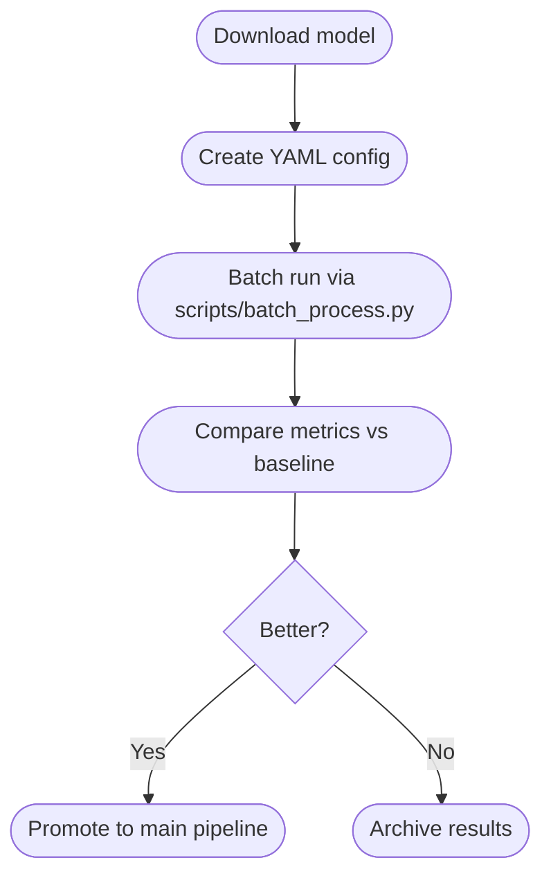

# Advanced Separation Exploration

A living checklist of heavier models that go beyond the current HTDemucs+MDX fusion. Each candidate targets aggressive music removal while preserving speech timbre.

| Model family | Variant / weights | Why try it | Notes |
|--------------|-------------------|------------|-------|
| UVR-BVE MDXNET | `UVR-BVE-MDXNET-3.onnx` | Tuned for vocal extraction with minimum artefacts | Requires ONNXRuntime w/ CUDA EP |
| FRUITS.COCTAIL | `UVR-MDX-NET-Voc_FT.onnx` | Overfits to speech formants; often used by Koala-De-Noise | Combine with Wiener post-mask |
| Hybrid Transformer v4 | `htdemucs_6s_8shifts` | Finetuned on Libri+MUSDB; rumored better bleed control | Needs `dora-search` launcher |
| Koala De-Noise | `Koala-Beta` checkpoint | Speech-only denoiser after MDX | PyTorch inference, heavy on VRAM |
| Spleeter++ | `4stems vocal_hq` | Fast sanity check baseline | CPU fallback |

## Evaluation plan
1. Download each model into `improvement/models/` (use `.url` manifest files).
2. Run `scripts/evaluate.py` with new `--separation-config` referencing the candidate.
3. Log LUFS, masked music-to-speech, STOI, SI-SDR, and WER deltas in `improvement/experiments.csv`.
4. Promote models that beat current pipeline by ≥ 3 dB music suppression **without** STOI drop > 0.01 or WER degradation.

